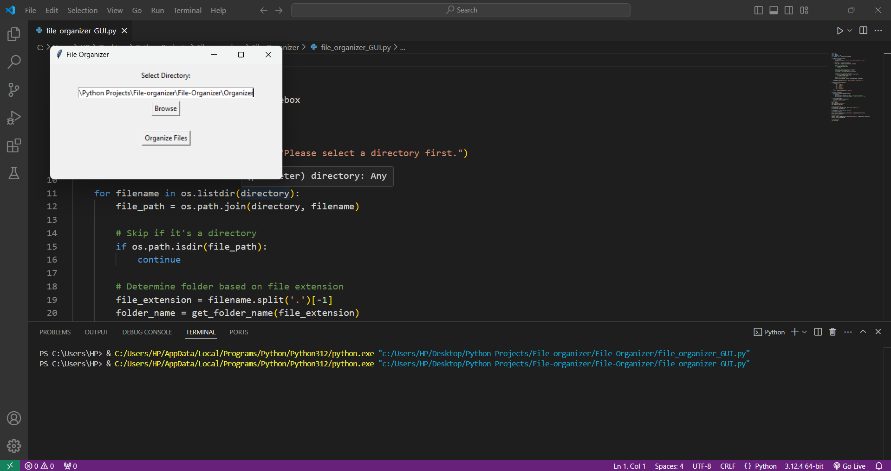
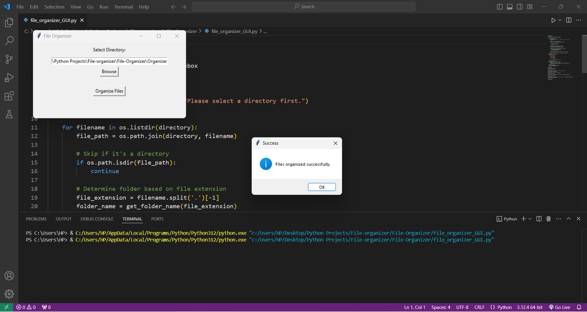
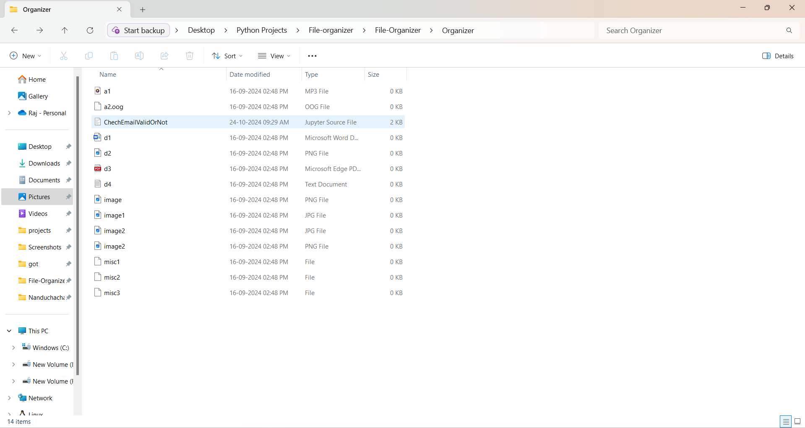
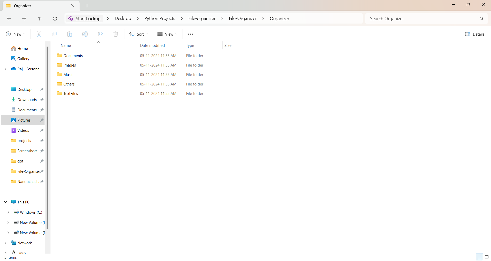
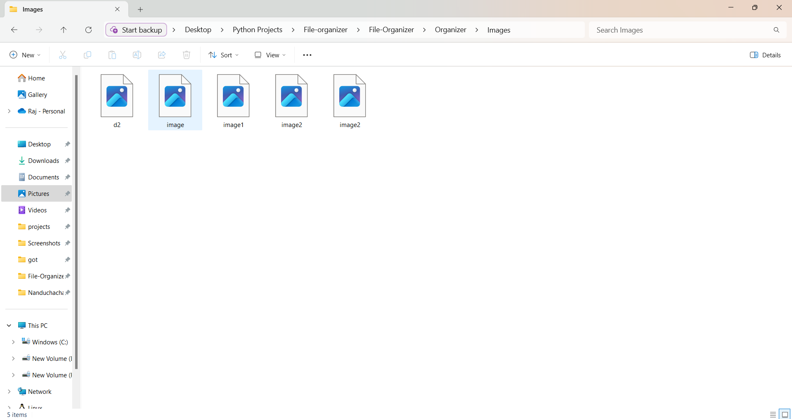
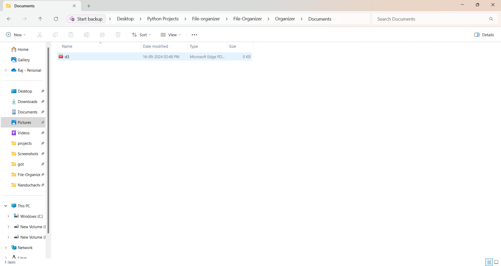
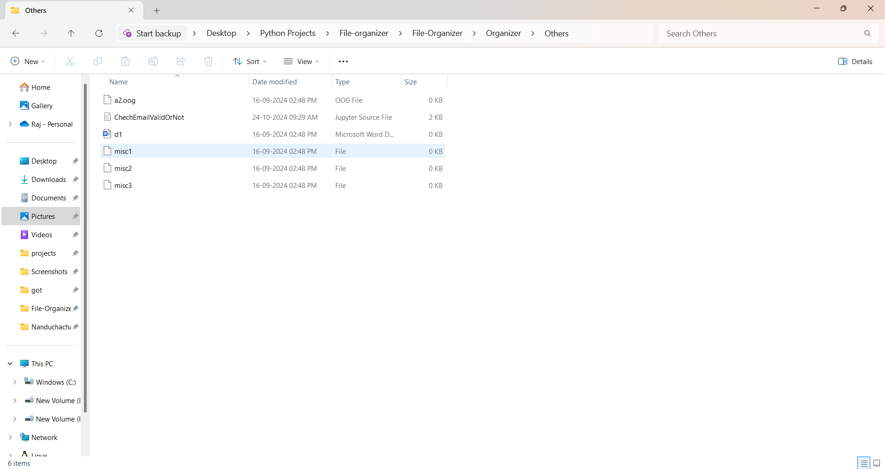

# File Organizer  
A Python script that helps you organize files in a specified directory by grouping them based on their file extensions. The script will move files to corresponding folders (e.g., .jpg files go to a Images folder, .pdf files to a Documents folder) to keep your directory tidy.  

**Features**   
	&emsp;o Sorts and organizes files based on file extensions.  
	&emsp;o Automatically creates folders for each file type if they do not already exist.  
	&emsp;o Moves files to their corresponding folders.  
	&emsp;o Works with any directory on your system.  

**Technologies Used**   
	&emsp;o Python  
	&emsp;o OS Module  
 
**Usage**  
The File Organizer GUI application allows you to easily sort files within a selected directory based on their file extensions. Follow the instructions below to use the GUI effectively.  
The script will create folders based on file extensions (e.g., Images, Documents, Music) and move the corresponding files into these folders.  

**Example:**  
Suppose you have the following files in a directory:   
/Downloads 
├── vacation.jpg 
├── song.mp3 
├── report.pdf 
├── script.py 

Running the script will organize the files as follows: 
/Downloads  
├── Images 
│   └── vacation.jpg 
├── Music 
│   └── song.mp3 
├── Documents 
│   └── report.pdf 
├── Scripts 
│   └── script.py   

### Screenshots

## GUI 
  

### Organizing Files
 

### Organized Directory View
      
